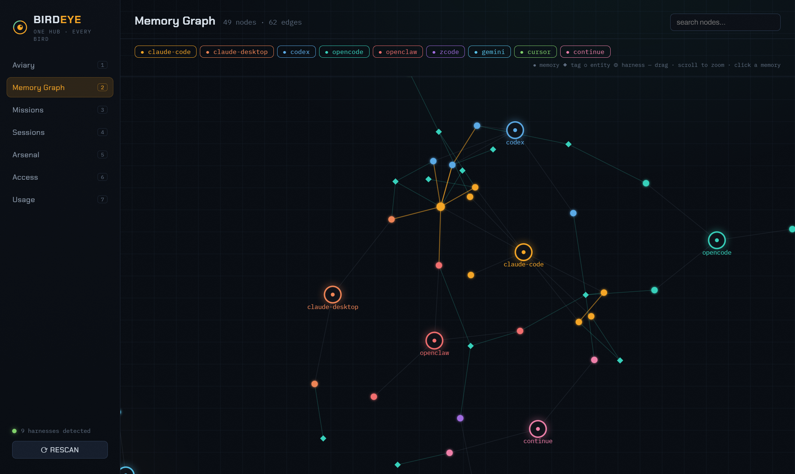
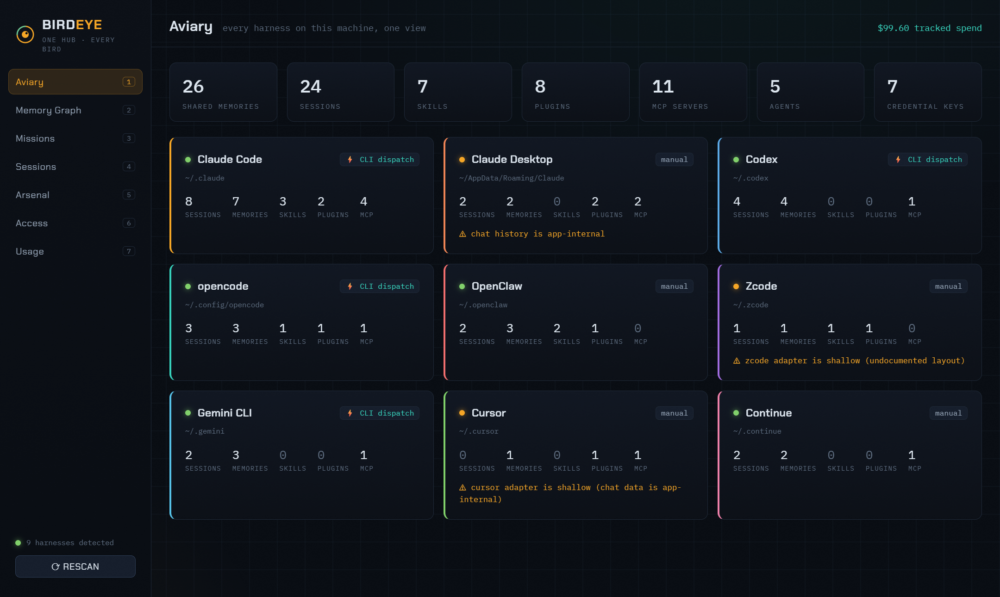
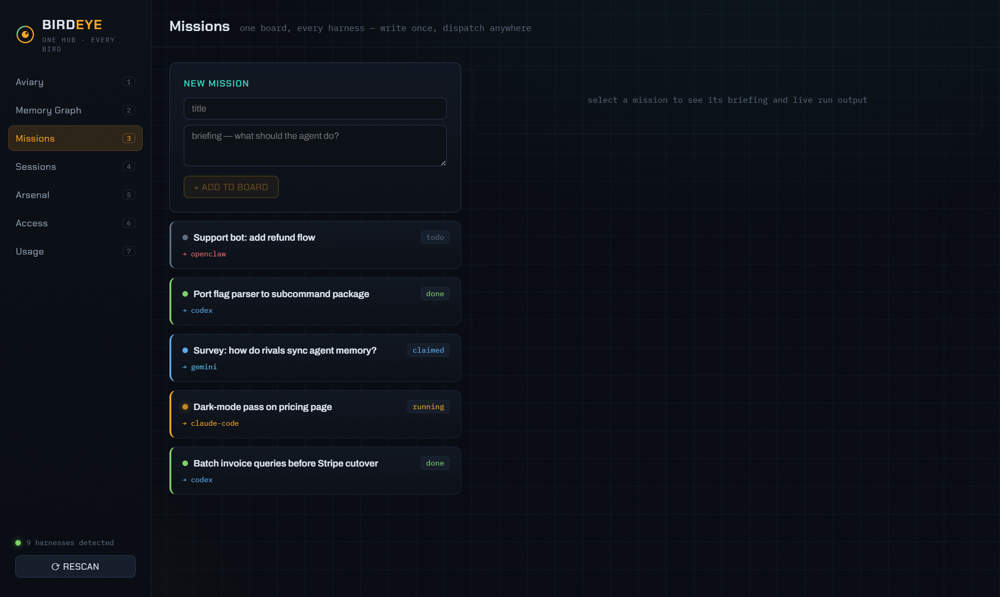
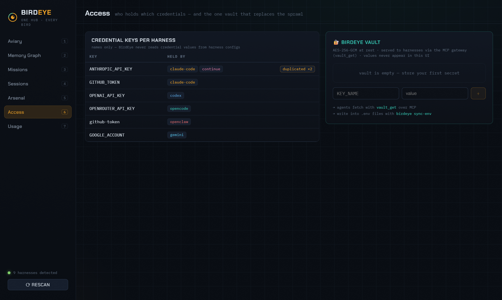

<div align="center">

# 🦅 BirdEye

**One hub, every bird.**
Local-first mission control for all your AI agent harnesses — Claude Code, Claude Desktop, Codex, opencode, OpenClaw, Zcode, Gemini CLI, Cursor, Continue.

[](LICENSE)
[](#quick-start)
[](#how-it-runs)
[](CONTRIBUTING.md)



</div>

---

## The problem

If you use more than one AI agent harness, you know this pain:

1. **Every harness is an island.** Each has its own sessions, memories, MCP servers, plugins, skills, and routines. Nothing is shared.
2. **Memory doesn't travel.** What Claude Code learned about you yesterday, Codex re-asks today. Import tools — where they exist — are per-harness and incompatible.
3. **Credentials multiply.** Giving agents access to GitHub means configuring auth in every single harness. N harnesses = N copies of every token.
4. **Zero visibility.** Which harness can touch what? How many tokens has each burned? Nobody can tell you.
5. **No shared work.** You can't assign a task from one place and have different harnesses pick it up.

## What BirdEye does

BirdEye is a **daemon on `127.0.0.1` + an interactive dashboard + one MCP gateway** that every harness joins. Free, MIT, no cloud, no telemetry — your data never leaves your machine.

| Pillar | What you get |
|---|---|
| 🗺️ **Unified inventory** | Read-only adapters scan all 9 harnesses' on-disk state into one normalized model: sessions, memories, skills, plugins, MCP servers, agents, credential key *names*, usage. |
| 🧠 **Collective memory** | Every harness's native memory imported, deduped, and rendered as an **interactive memory graph**. Two-way: `birdeye memory sync-back` writes a shared memory pack into each harness's context file (`CLAUDE.md`, `GEMINI.md`, `AGENTS.md`…) inside safe marker blocks. |
| 🔐 **MCP gateway + vault** | One MCP server every harness registers with a single line. Any agent in any harness gets `memory_search` / `memory_save`, a shared task queue, and `vault_get` — secrets stored **once**, AES-256-GCM encrypted. |
| 🎯 **Missions** | A shared task board. Write a briefing once, dispatch to any harness with a headless CLI (`claude -p`, `codex exec`, `opencode run`, `gemini -p`) and watch output stream live. |

<div align="center">

</div>

## Quick start

Requires **Node ≥ 23.6** (BirdEye runs TypeScript natively — no build step for the daemon).

```bash
git clone https://github.com/zanni098/BirdEye.git
cd BirdEye
npm install
npm run build          # builds the dashboard (one-time, ~1s)

npm run demo           # → http://127.0.0.1:4477 with rich demo data
# or scan YOUR machine:
npm run up
```

Then wire your harnesses into the hub:

```bash
node packages/cli/bin/birdeye.ts scan                    # inventory every harness
node packages/cli/bin/birdeye.ts register claude-code    # add the BirdEye MCP gateway (with backup)
node packages/cli/bin/birdeye.ts register codex          # ...same one-liner for each harness
node packages/cli/bin/birdeye.ts vault set GITHUB_TOKEN ghp_yourtoken
node packages/cli/bin/birdeye.ts memory sync-back        # push shared memory into every context file
```

## The dashboard

Seven views, live over WebSocket:

- **Aviary** — fleet overview: one card per harness with health, counts, warnings, dispatch capability.
- **Memory Graph** — the shared brain, drawn: memories colored by source harness, tags, auto-extracted entities, `[[links]]`. Drag, zoom, filter, click any node for full detail.
- **Missions** — task board with live dispatch streaming.
- **Sessions** — cross-harness session timeline with filters.
- **Arsenal** — skills / plugins / MCP matrix: see instantly that `github` MCP is configured 4 separate times.
- **Access** — which harness holds which credential keys (names only), with duplication flagged — plus the encrypted vault.
- **Usage** — tokens and cost per harness. Honest: harnesses that don't log usage show *unknown*, never invented numbers.

<div align="center">


</div>

## Harness support

| Harness | Sessions | Memories | Skills | Plugins | MCP | Usage | Dispatch |
|---|:-:|:-:|:-:|:-:|:-:|:-:|:-:|
| Claude Code | ✅ | ✅ | ✅ | ✅ | ✅ | ✅ | ⚡ `claude -p` |
| Claude Desktop | ◐ | — | — | ✅ | ✅ | — | manual |
| Codex | ✅ | ✅ | — | — | ✅ | ✅ | ⚡ `codex exec` |
| opencode | ✅ | ✅ | ✅ | ✅ | ✅ | ◐ | ⚡ `opencode run` |
| OpenClaw | ✅ | ✅ | ✅ | ✅ | ◐ | — | manual |
| Zcode | ◐ | ◐ | ✅ | ✅ | — | — | manual |
| Gemini CLI | ✅ | ✅ | — | — | ✅ | ◐ | ⚡ `gemini -p` |
| Cursor | — | ✅ | — | ✅ | ✅ | — | manual |
| Continue | ✅ | ✅ | — | — | ✅ | ◐ | manual |

✅ full · ◐ best-effort · — the harness doesn't expose it on disk

## The MCP gateway

`birdeye register <harness>` adds one entry to that harness's MCP config (original backed up first). After that, **any agent in any harness** can call:

| Tool | Does |
|---|---|
| `memory_search {query}` | search the unified, deduped memory of *all* harnesses |
| `memory_save {title, body, tags?}` | save a memory every other harness can recall |
| `task_list` / `task_claim` / `task_update` | the shared work queue |
| `vault_get {key}` | fetch a secret stored once in the encrypted vault |

## Security model

- The daemon binds **`127.0.0.1` only**. No telemetry, no outbound calls.
- Adapters are **read-only**; scanning never touches your harness files.
- Credential **values are never read** from harness configs — key names only. The dashboard never displays secret values; `vault_get` flows only over local stdio MCP.
- Vault: AES-256-GCM, scrypt-derived key (`BIRDEYE_VAULT_PASSPHRASE`, or a machine-derived default).
- The only writers — `register`, `sync-env`, `memory sync-back` — are explicit commands that create timestamped backups and, for context files, only ever touch the `<!-- BIRDEYE:START/END -->` block.

## How it runs

TypeScript monorepo, zero native dependencies, no compile step for the daemon (Node's native type-stripping). Vite builds the dashboard once.

```
packages/core      types · JSON store · dedup · memory graph · marker sync · vault
packages/adapters  9 harness scanners + registry (failure-isolated)
packages/server    Hono daemon: REST + WebSocket + dispatcher + demo mode
packages/mcp       the MCP gateway (stdio) + per-harness registration snippets
packages/cli       birdeye up · scan · register · vault · sync-env · memory · dispatch
apps/dashboard     React + d3-force dashboard
```

`npm test` — 62 tests across every package, fixture-driven.

## Honest limits (v1)

- Usage stats depend on what each harness logs locally — rich for Claude Code/Codex, honest *unknown* elsewhere.
- Cursor/Continue chat data lives in app-internal storage; those adapters are shallower.
- Dispatch needs the harness CLI on your PATH.
- Cross-harness collaboration is via shared memory + shared task queue; automatic result-chaining between harnesses is on the roadmap.

## Roadmap

- [ ] Result-chaining: harness A's output feeds harness B's next task
- [ ] Embedding-based memory similarity edges (currently: links, tags, entities)
- [ ] More adapters — Aider, Windsurf, Cline… ([add one — it's ~100 lines](CONTRIBUTING.md))
- [ ] `npx birdeye` as a published npm package

## Contributing

Adapters are the sweet spot — one focused file + a fixture + a test. See [CONTRIBUTING.md](CONTRIBUTING.md).

MIT © BirdEye contributors
